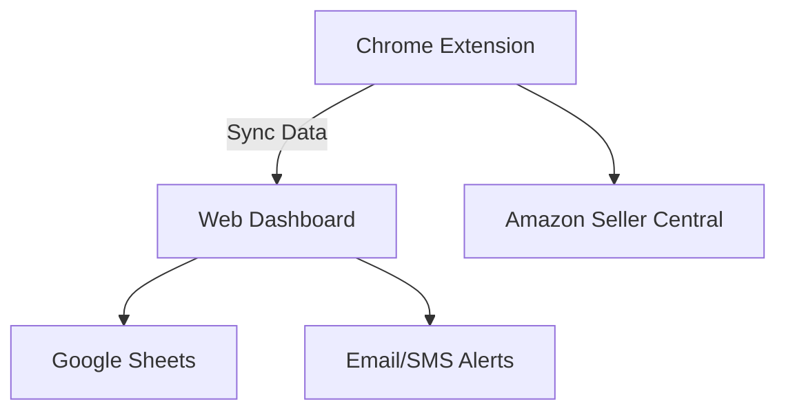

<div align="center">
  

# My Amazon Analytics

### Enterprise-Grade Amazon Advertising Analytics Platform

[](https://app.netlify.com/sites/my-amazon-analytics/deploys)
[](https://www.typescriptlang.org/)
[](https://reactjs.org/)
[](LICENSE)
[](CONTRIBUTING.md)
[](https://twitter.com/intent/tweet?text=Check%20out%20My%20Amazon%20Analytics%20-%20The%20ultimate%20Amazon%20Advertising%20dashboard&url=https%3A%2F%2Fgithub.com%2Fjohnwesleyquintero%2Fmy-amazon-analytics)

**Transform Your Amazon Advertising Strategy with Data-Driven Insights**

[🚀 Live Demo](https://myamazonanalytics.vercel.app/) • [Production Domain](https://myamazonanalytics.vercel.app/) • [📚 Documentation](https://github.com/johnwesleyquintero/my-amazon-analytics/tree/8892d351e1ac4f1d2f5b1fdacecef628a819c68e/docs) • [🐞 Report Issue](https://github.com/johnwesleyquintero/my-amazon-analytics/issues)

</div>

---

## 🌟 Key Features

### 📊 Comprehensive Analytics

- Real-time campaign performance tracking
- Advanced search term analysis
- Competitor benchmarking
- Automated performance alerts

### 🔄 Seamless Integrations

- Amazon Seller Central API
- Google Workspace (Sheets, Drive)
- Chrome Extension for quick access
- Webhooks for custom integrations

### 🛠️ Powerful Tools

- AI-powered bid optimization
- Automated rule engine
- Custom report builder
- Multi-account management

## 🏗️ Architecture Overview



---

## 🚀 Getting Started

### Prerequisites

- Node.js 18+
- Amazon Seller Central API credentials

### Installation

```bash
git clone https://github.com/johnwesleyquintero/my-amazon-analytics.git
cd my-amazon-analytics
npm install
cp .env.example .env
```

### Configuration

1. Update environment variables in `.env`
2. Set up Amazon API credentials

### Running Locally

```bash
npm run dev
```

### Building for Production

```bash
npm run build
```

---

## 📈 Feature Roadmap

| Quarter | Features                               |
| ------- | -------------------------------------- |
| Q3 2023 | Basic Dashboard                        |
| Q4 2023 | Chrome Extension, Automated Rules      |
| Q1 2024 | AI Optimization, Multi-Account Support |
| Q2 2024 | Mobile App, Advanced Reporting         |

---

## 🤝 Contributing

We welcome contributions! Please see our [Contribution Guidelines](CONTRIBUTING.md) for details.

1. Fork the repository
2. Create your feature branch (`git checkout -b feature/AmazingFeature`)
3. Commit your changes (`git commit -m 'Add some AmazingFeature'`)
4. Push to the branch (`git push origin feature/AmazingFeature`)
5. Open a Pull Request

---

## 📜 License

Distributed under the MIT License. See `LICENSE` for more information.

---

## 📞 Contact

John Wesley Quintero - [@wescode](https://twitter.com/wescode) - info.wescode@gmail.com

Project Link: [https://github.com/johnwesleyquintero/my-amazon-analytics](https://github.com/johnwesleyquintero/my-amazon-analytics)

---

## 🙏 Acknowledgments

- Amazon Advertising API Team
- Vercel for deployment tools
- All our beta testers and contributors
